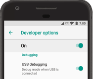

# Product Finder App

The main purpose of the App is to help people locate products in stores.
The app also provides a feature to locate the closest stores and create a shopping list.

For further details on the different functionalities check out the documentation "Eigenheer-Yamin_Marie-Aurelien_EPRP_final-report.pfd"

## Prerequisites:

Android Studio Giraffe | 2022.3.1 Patch 1 was used for the development

Compile SDK Version -> 34 (API 34)
Einstellen im Android Studio unter "File" - "Project Structure" - "Modules"

# Installation der Produktfinder-App auf Ihrem Android-Gerät

## Anleitungen:

Run apps on a hardware device: https://developer.android.com/studio/run/device

Debugging aktivieren: https://developer.android.com/studio/debug/dev-options

## Voraussetzungen:

- Android Studio installiert auf Ihrem Computer (Version Siehe Prerequisites)
- Ein Android-Gerät oder ein Emulator
- USB-Debugging auf Ihrem Android-Gerät aktiviert 
  - a.	Gehen Sie auf Ihrem Android-Gerät in die Einstellungen. 
  - b.	Geben Sie "Build-Nummer" ein in der Suchliste.  
  - c.	Tippen Sie mehrmals auf "Build-Nummer", bis Sie eine Benachrichtigung erhalten, dass Sie Entwickler sind. 
  - d.	Gehen Sie zurück und öffnen Sie die "Entwickleroptionen". 
  - e.	Aktivieren Sie "USB-Debugging".

## Schritte zur App Installation:
- Repository klonen:
  - a.	https://github.com/EigenYam/ProduktFinder
  - b.	Öffnen Sie die Kommandozeile auf Ihrem Computer. 
  - c.	Geben Sie git clone https://github.com/EigenYam/ProduktFinder.git ein. 
  - d.	Oder laden Sie de ZIP Datei herunter.

- Android Studio öffnen:
  - a.	Starten Sie Android Studio. 
  - b.	Wählen Sie "Open an existing project" und navigieren Sie zum geklonten Repository.

- Gerät anschliessen:
  - a.	Verbinden Sie Ihr Android-Gerät über USB mit Ihrem Computer.   
  - b.	Es sollte in Android Studio im Bereich für angeschlossene Geräte angezeigt werden. 
  - c.	DEBUGGING MUSS AKTIVIERT SEIN

- App auf dem Gerät ausführen:
  - a.	Wählen Sie Ihr Gerät in der Geräteliste von Android Studio aus.
  - b.	Klicken Sie auf den 'Run'-Button (grüner Pfeil).
  - c.	Die App wird kompiliert und auf Ihrem Gerät installiert.

- App testen:
  - a.	Nach erfolgreicher Installation öffnet sich die App automatisch auf Ihrem Gerät.
  - b.	Überprüfen Sie alle Funktionalitäten der App.

## Fehlerbehebung

Sollten Probleme bei der Installation oder Ausführung der App auftreten, überprüfen Sie:
•	Probleme lösen:
•	Überprüfen Sie, ob das USB-Debugging korrekt aktiviert ist.
•	Stellen Sie sicher, dass Sie die richtige Version des Android SDK verwenden.
•	Überprüfen Sie, ob alle Abhängigkeiten im Projekt ordnungsgemäss installiert sind.
•	Bei weiteren Problemen erstellen Sie ein Issue im GitHub-Repository.

